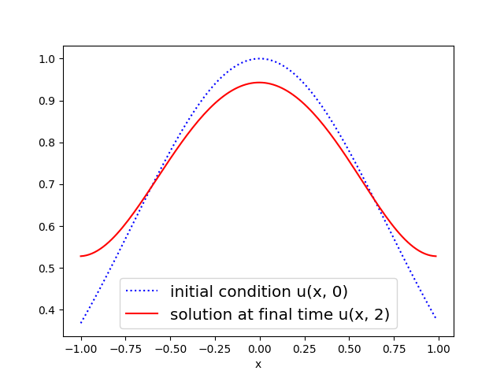

*************
Advection
*************

* source: advection_1d.py_

* example code: example_advection.py_

* scalar PDE with unknown function :math:`u(x,t)` of two independent variables

* discretization:

    * first-order upwind finite differences in space,
    * backward Euler in time

.. _example_advection.py: https://github.com/pymgrit/pymgrit/tree/master/examples/example_advection.py

.. _advection_1d.py: https://github.com/pymgrit/pymgrit/tree/master/src/pymgrit/advection/advection_1d.py

The advection equation in 1D space is a partial differential equation that governs the motion of a scalar quantity, :math:`u(x,t)`,
subject to a known nonzero (constant) flow speed, :math:`c`. The governing equation is given by

.. math::
    u_t + cu_x = 0 \;\;\text{ in } \;[a, b]\times(t_0, t_{end}]\;\; \text{ with }\; u(x, t_0) = u_0(x),

and subject to some boundary conditions in space.

While parallel-in-time algorithms are known to work well for parabolic problems, most methods show instabilities
or poor convergence for hyperbolic problems. The advection equation has proven to be a critical test problem and
is therefore included in PyMGRIT. However, the discretization considered in PyMGRIT's 1D advection application is highly diffusive and does not capture
the exact solution.

In example_advection.py_, advection subject to flow speed :math:`c = 1`,
in the domain :math:`[-1,1]\times[0,2]` is considered with periodic boundary conditions in space and
subject to the initial condition :math:`u(x,0) = e^{-x^2}`.

