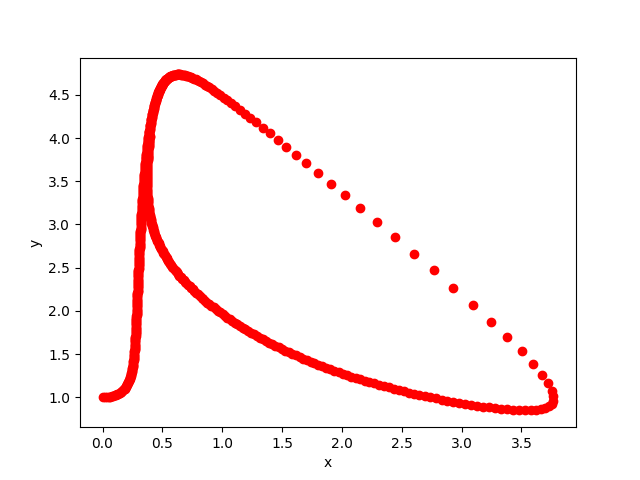

***********
Brusselator
***********

* source: brusselator.py_

* example code: example_brusselator.py_

* system of two scalar first-order ODEs with two unknown functions

* discretization: RK4

.. _example_brusselator.py: https://github.com/pymgrit/pymgrit/tree/master/examples/example_brusselator.py

.. _brusselator.py: https://github.com/pymgrit/pymgrit/tree/master/src/pymgrit/brusselator/brusselator.py

The Brusselator is a theoretical model for a chain of chemical reactions.
It can be described by the following system of ODEs:

.. math::
    x' &= A + x^2y - (B + 1)x,\\
    y' &= Bx - x^2y,

with positive concentrations :math:`A` and :math:`B`. If :math:`A` and :math:`B` are constant and :math:`B > A^2 + 1`,
the system will form a limit cycle.

In example_brusselator.py_, :math:`A = 1`, :math:`B = 3`, and the initial conditions are chosen to be

.. math::
    x(0) = 0 \;\;\;\text{and} \;\;\; y(0) = 1,

which produces the output:

